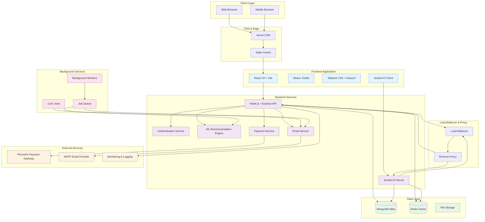
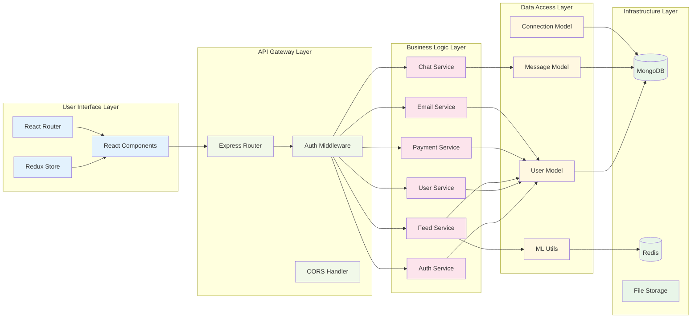
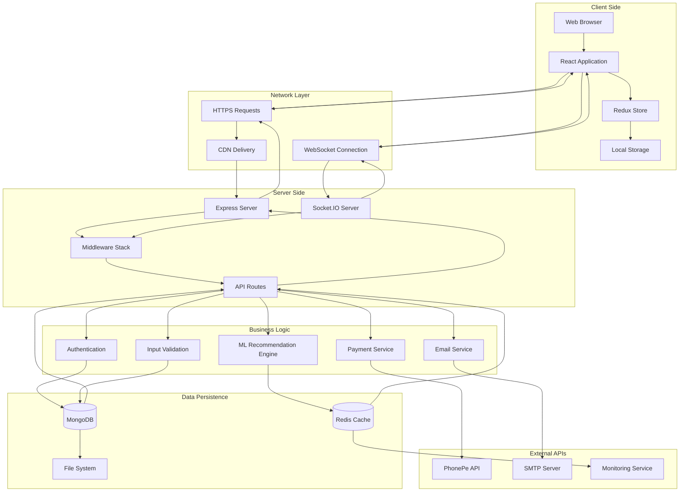
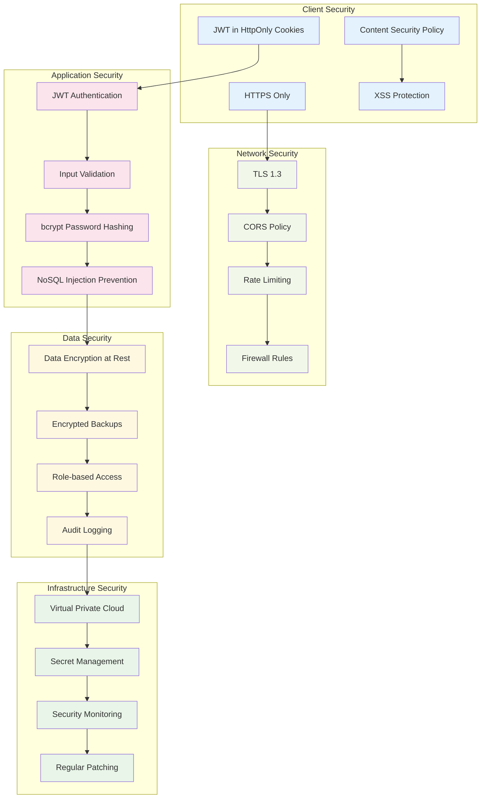
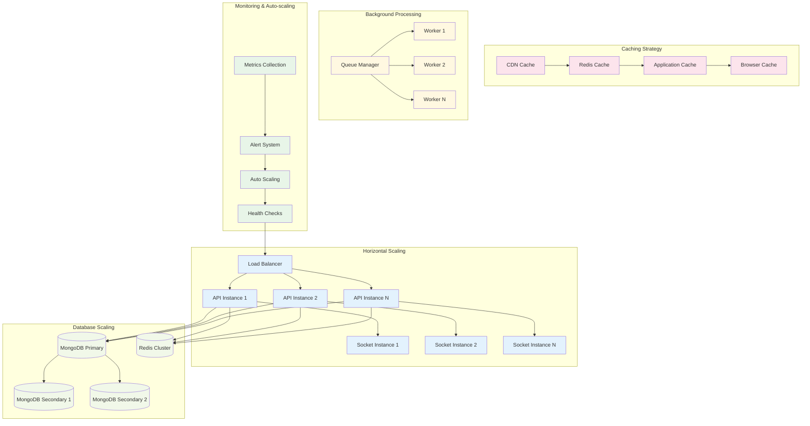
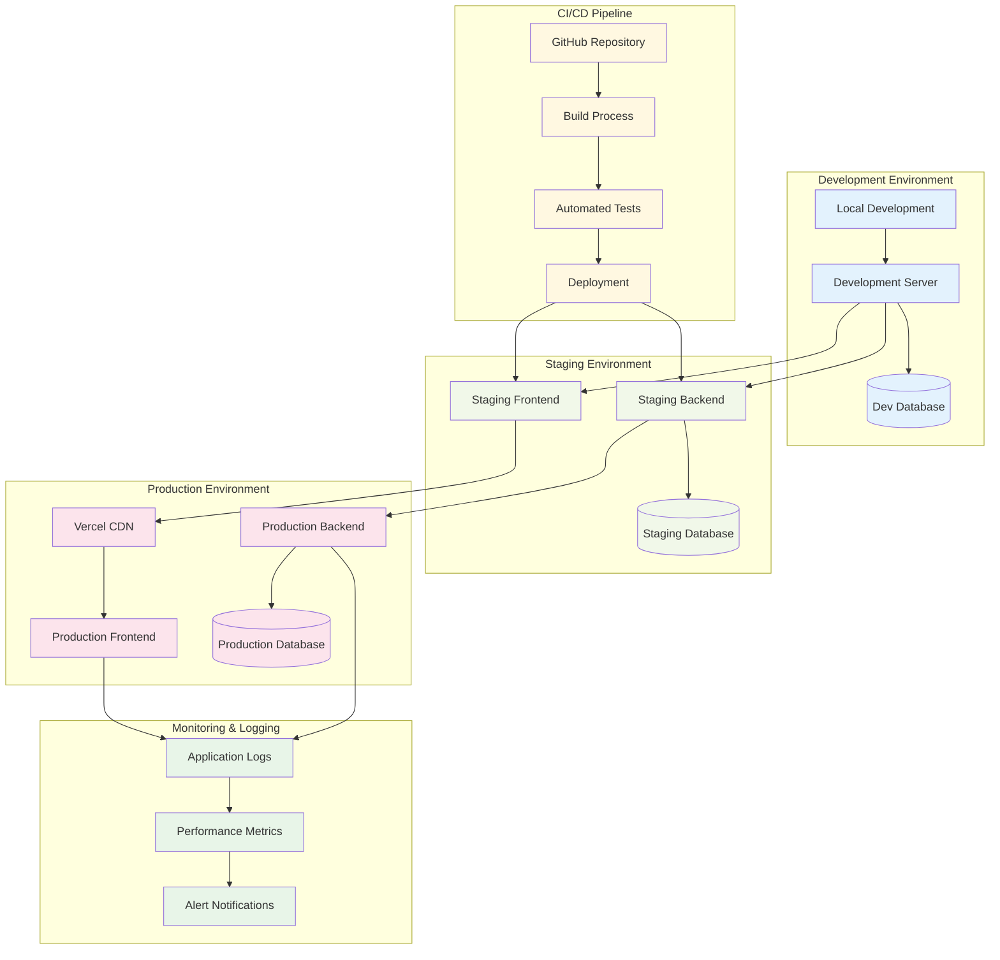

# DevConnect - High-Level Design (HLD)

## System Architecture Overview

## Component Interaction Diagram

## Data Flow Architecture

## Security Architecture

## Scalability Architecture

## Deployment Architecture

