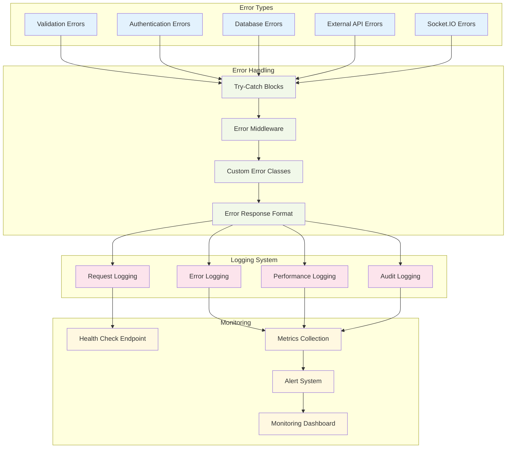

# DevConnect - Low-Level Design (LLD)

## Database Schema Design

## API Endpoint Design

## Component Architecture (Frontend)

## ML Recommendation Engine Design

## Socket.IO Event Flow Design

## Authentication & Authorization Flow

## Payment Integration Design

## Error Handling & Logging Design

## Performance Optimization Design

