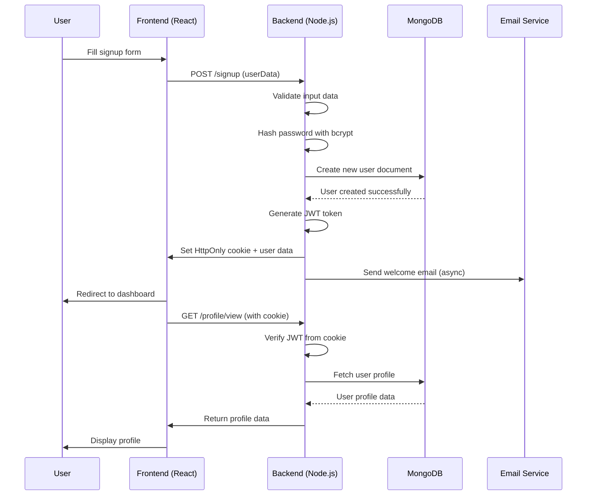
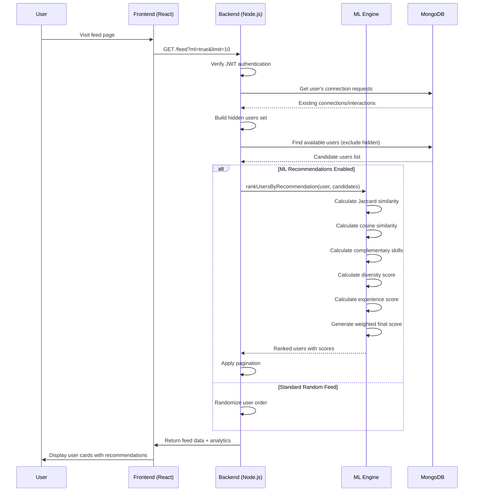
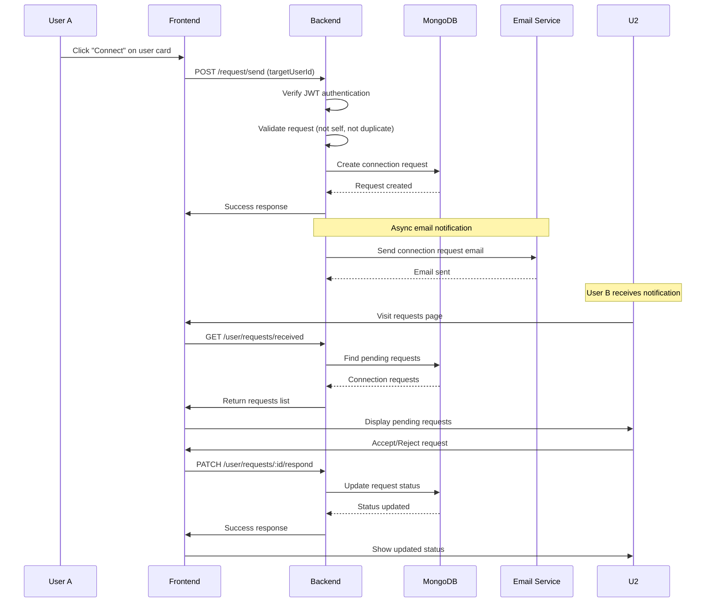
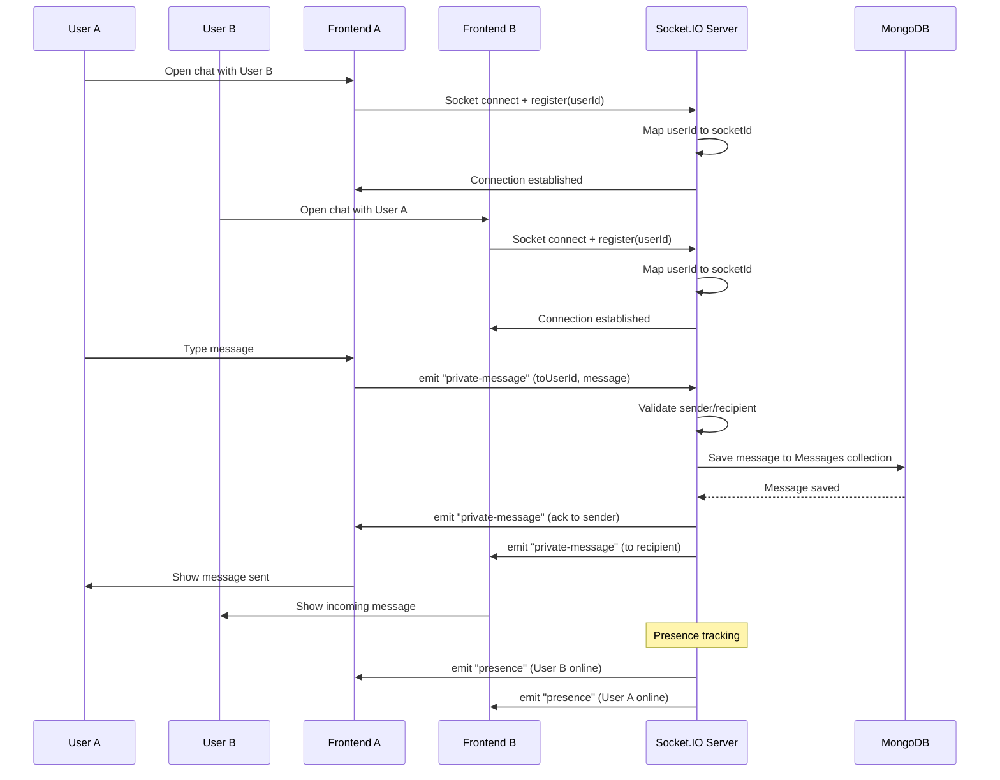
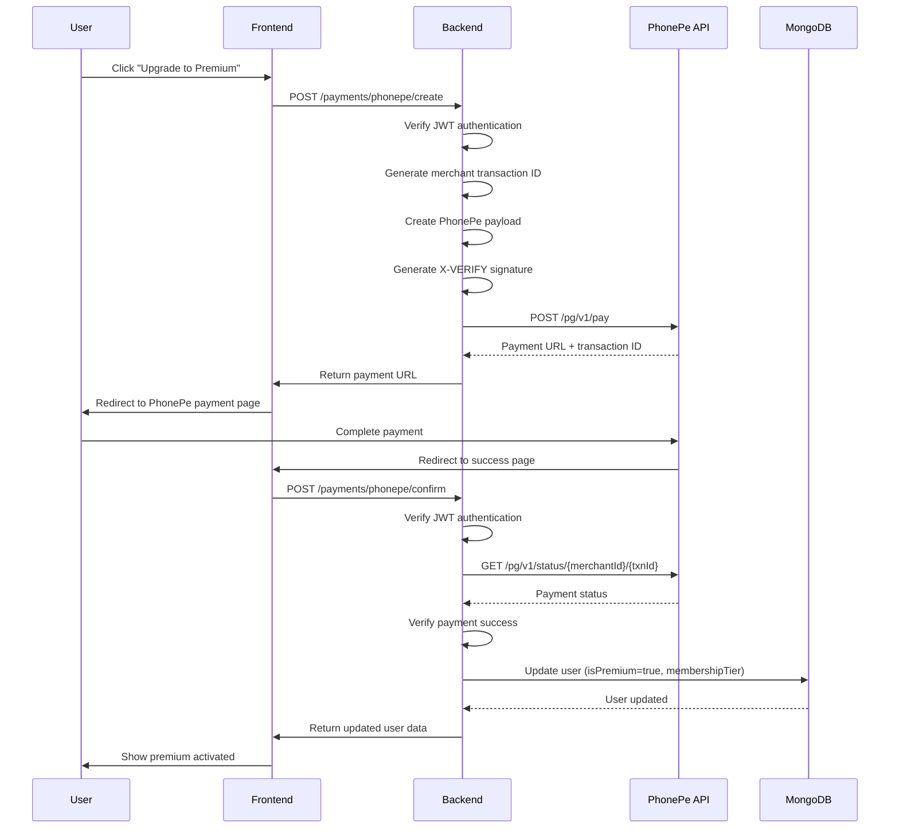
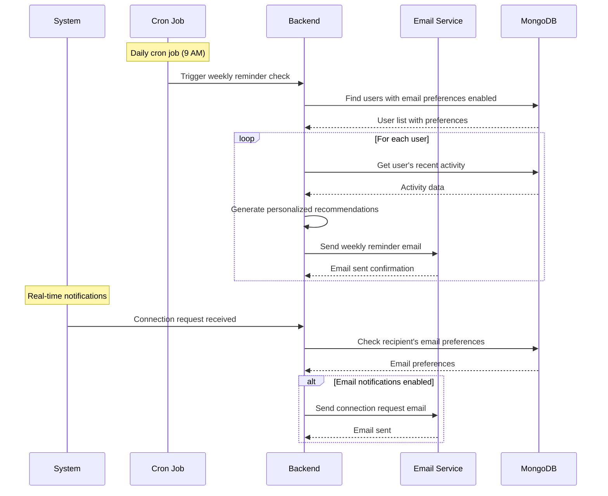
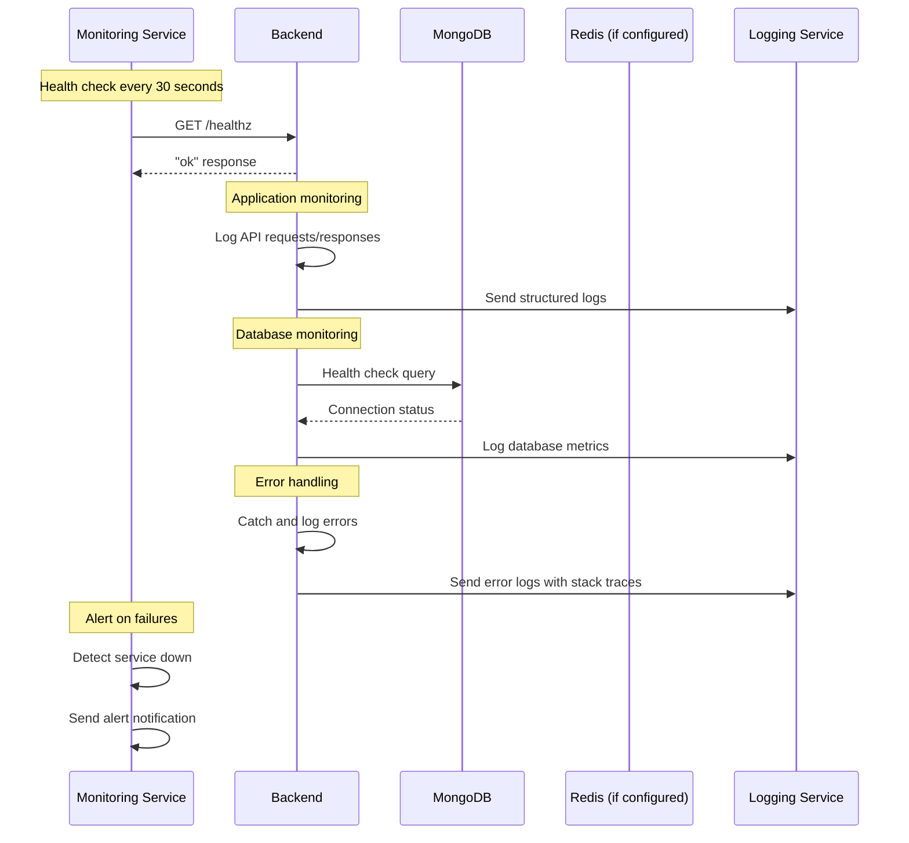
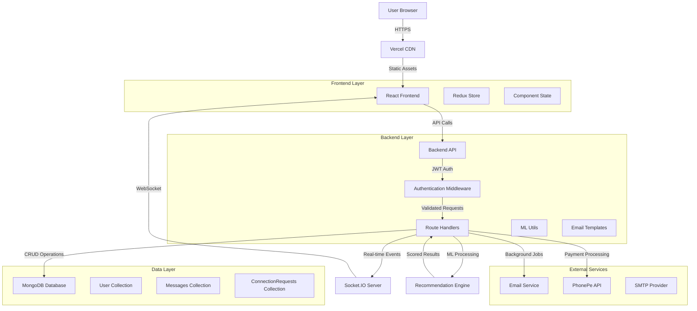

# DevConnect - Workflow Diagrams

## 1. User Registration & Authentication Workflow

## 2. Feed Discovery & ML Recommendations Workflow

## 3. Connection Request Workflow

## 4. Real-time Chat Workflow

## 5. Payment & Premium Activation Workflow

## 6. Email Notification Workflow

## 7. System Health & Monitoring Workflow

## 8. Data Flow Architecture

